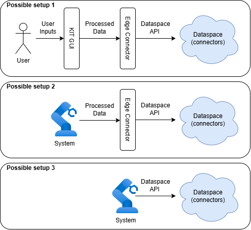
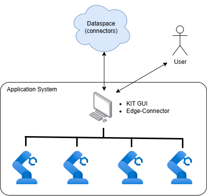

### Introduction to KIT GUI

We introduce two software `KIT GUI` (Frontend) and `Edge-Connector` (Backend).
We use them to create and interact with KITs in the dataspace based on the RoX KIT concept.
They mainly provide intuitive data handling and automated dataspace operations to simplify the user experience in using KITs.

**Important:** these software run in a specific dataspace architecture, where connectors are running in the dataspace server (e.g., DLR dataspace and T-System dataspace).
Here, we have three possible system working setups.

  

1. **Setup 1:** Human users enter data through graphical tools, `KIT GUI` refines the data, and `Edge-Connector` handle the interaction with the dataspace.
2. **Setup 2:** The application system interacts with `Edge-Connector` by providing the data using the correct schema.
3. **Setup 3:** The application system directly interacts with the dataspace. In this case, data handling and dataspace operations (e.g., negotiation, contract making, etc.) are entirely managed by your system.

For learning purpose, we will use Setup 1 in our tutorials.

### Benefits

`KIT GUI` and `Edge-Connector` bring the following benefits:
- `KIT GUI` allows users to read/write the KIT information in simplified, human-readable formats. Monitoring, searching, creating, deleting, and editing KITs can be done with visual and interactive components.
- In `Edge-Connector`, the user input data are converted into the correct format required by the dataspace API. Also, repetitive and multi-step dataspace interactions are automated.

### Example Deployment

`Edge-Connector` can serve as a *gateway* in your system as shown below. Any exchanged KITs (either as downloaded files, containers, or data stream from services) can be shared within your system flexibily.

  

### Where to start?

Start with the `Guide` menu in the left hand panel in `KIT GUI`. 
It contains example-based instructions.

The guide currently covers:
- **Getting Started**: Enabling `Edge-Connector` with your dataspace user certificate files.
- **Providing KITs**: Creating a Basic KIT (CIFAR-10 dataset).
- **Providing KITs**: Management of your KITs (Monitoring, editing).
- **Providing KITs**: Making your KITs visible for search and negotiation (i.e., contract definitions).
- **Consuming KITs**: Search KITs with conditional queries.
- **Consuming KITs**: Downloading KITs (into the shared memory where your application can access).

Below are currently work-in-progress and will be provied soon:
- **Providing KITs**: Creating a Composite KIT (AI-based digital twin robot training)
- **Consuming KITs**: Getting the live streaming data.
- **Consuming KITs**: Redirecting KITs to another endpoint.
- **Consuming KITs**: AI-assisted search.

### Change Log:
- `KIT GUI` v1.0: first release with basic features around Basic KITs.

### Additional Documents

- RoX KIT Concept Document: https://statics.teams.cdn.office.net/evergreen-assets/safelinks/2/atp-safelinks.html

